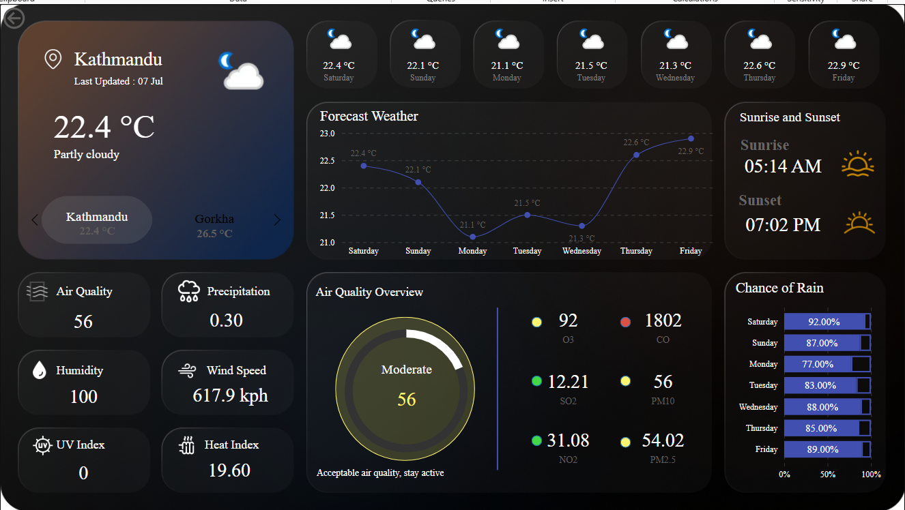

# 🌤️ Weather Dashboard - Power BI

This project is a fully interactive weather monitoring dashboard built with **Power BI**, showcasing real-time temperature, air quality index, wind speed, humidity, and chance of rain.

## 📊 Features

- Live weather data for Kathmandu
- 7-day temperature trend forecast
- Air quality metrics (O3, CO, NO2, PM2.5, PM10, SO2)
- Sunrise and sunset times
- Rainfall probability
- Wind speed and heat index

## 🔧 Tools Used

- Power BI
- DAX / Data Modeling
- Weather API from www.weatherapi.com
- PNG snapshot for preview

## 🖼️ Dashboard Preview

## 📁 Project File

You can download and explore the dashboard using Power BI Desktop:
- `Weather_Dashboard.pbix`

Feel free to fork or clone the repository and try it out !!!
